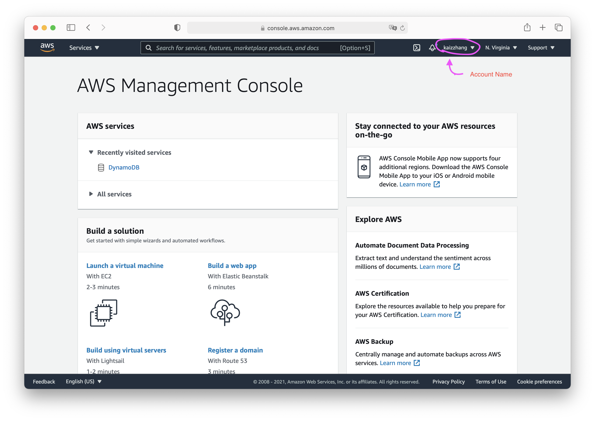

# cs1660-cloud-storage-hw

## Screenshot of my AWS account

## Scrrenshot of my installed Amazon Python Boto3 SDK

## Print of my code

My code (***storage.py***) is push in this github repo.

## Screenshot of the query

The query is implemented as a function in my program

## Screenshot of the query result

Both the dynamoDB table and the data pulled from that table are included.

